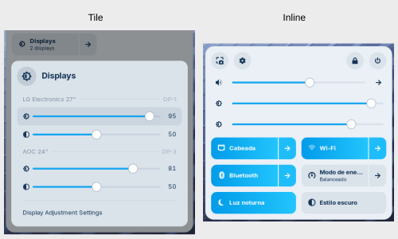

# Multi Display Adjustment GNOME shell extension

> Originally based on [display-adjustment](https://gitlab.com/w8jcik/display-adjustment) by Maciej Wójcik.
> Details: [CHANGELOG.md](./CHANGELOG.md).

Offers sliders in Quick Settings to control the brightness and contrast of external displays
through DDC/CI, one set per display, under the display name that Settings shows. Moving a slider
shows the level in the on-screen display of the screens it adjusts, as GNOME does for a laptop's
own screen.



Extension relies on `ddcutil-service`. Installation process of `ddcutil-service` is quick and non-intrusive. `ddcutil-service` allows more responsive communication with the displays than calling `ddcutil`.

## Two ways to show the sliders

* **Tile** (the default, left above) — a single _Displays_ entry in Quick Settings opens a menu
  where every display has a brightness and a contrast slider, each with its level as a number from
  0 to 100. The entry is hidden when there are no displays.
* **Inline** (right above) — no tile: every display gets a brightness slider among the sliders of
  Quick Settings, right next to the brightness slider of GNOME, or below the volume sliders on a
  desktop, which has none. They look and behave like the slider of GNOME. Only brightness is shown
  this way.

## Settings

Preferences open from _Display Adjustment Settings_ at the bottom of the tile's menu, or from the
gear next to the extension in the Extensions app, which is the only way with inline sliders.

| Setting | Default | What it does |
| --- | --- | --- |
| **Placement** | Tile | _Tile_ or _Inline_, see above. |
| **Position** | Below | With inline sliders, whether they go _Below_ or _Above_ the brightness slider of GNOME. With a display above the laptop, _Above_ makes the sliders read in the same order as the screens. Has no effect on a desktop, which has no brightness slider of its own. |
| **Minimum brightness of 1%** | On | Keeps brightness from going below 1, since some displays turn the backlight off at 0 and leave no way to see the slider again. Turn it off to let the sliders go all the way down. |
| **Show contrast sliders** | On | Turn it off to keep only brightness. Greyed out with inline sliders, which only show brightness. |
| **Adjust all external displays together** | Off | One brightness slider, and one contrast slider in the tile, set the same level on every external display. Until a slider is moved, it shows the average of the current levels; turning this on does not write to the displays. The laptop's own screen is never included. Greyed out with fewer than two external displays. |

Settings can also be changed from a terminal, with the key names `slider-placement` (`tile` or
`inline`), `inline-position` (`below` or `above`), `limit-minimum-brightness`, `show-contrast` and
`group-displays`, for example

```bash
gsettings --schemadir ~/.local/share/gnome-shell/extensions/multi-display-adjustment@cecilio.xyz/schemas \
    set org.gnome.shell.extensions.multi-display-adjustment slider-placement inline
```

## Dependencies

* GNOME 46-50
* [_ddcutil-service_](https://github.com/digitaltrails/ddcutil-service)

## Installation

Install _ddcutil-service_ first, then the extension.

### Installation of _ddcutil-service_

* **Arch Linux** — [from the AUR](https://aur.archlinux.org/packages/ddcutil-service), for example `yay -S ddcutil-service`
* **openSUSE** — `sudo zypper install ddcutil-service`
* **Debian 12 and 13, Ubuntu 24.04 to 26.04** — unofficial `amd64` packages by Maciej Wójcik

  ```bash
  . /etc/os-release
  wget -O /tmp/ddcutil-service.deb "https://gitlab.com/api/v4/projects/w8jcik%2fddcutil-service.deb/packages/generic/${ID^}-${VERSION_ID}/1.0.14/ddcutil-service_1.0.14+${VERSION_CODENAME}-amd64.deb"
  sudo apt install /tmp/ddcutil-service.deb
  ```

* **Fedora and any other** — [build it from source](./installation.md#build-ddcutil-service-from-source)

Usually nothing else has to be set up for the displays to be reachable. If the sliders do not show
up, see [Access to the displays](./installation.md#access-to-the-displays).

### Installation of the extension

Install it from
[extensions.gnome.org](https://extensions.gnome.org/extension/10707/multi-display-adjustment/), in
the browser or with an app such as Extension Manager.

A new version shows up there once it passes review. To get the newest one before that, see
[Install from a release](./installation.md#install-from-a-release).

# Troubleshooting

* [Diagnosing issues](./troubleshooting.md#diagnosing-issues)
* [Known issues](./troubleshooting.md#known-issues)

# Thanks

* [@hopsayer](https://github.com/hopsayer), for the inline sliders and much of what came with them
  in 1.4.0.
* Everyone who reports an issue or tries a change on their own displays. See the
  [contributors](https://github.com/samuelcecilio/multi-display-adjustment/graphs/contributors) for
  everyone whose code is in here.

# License

This extension is distributed under the terms of the GNU General Public License, version 2 or later.

Copyright of the original work belongs to Maciej Wójcik and the contributors to
[w8jcik/display-adjustment](https://gitlab.com/w8jcik/display-adjustment). Modifications in this fork are
copyright their respective authors and released under the same license. See [COPYING](./COPYING).
